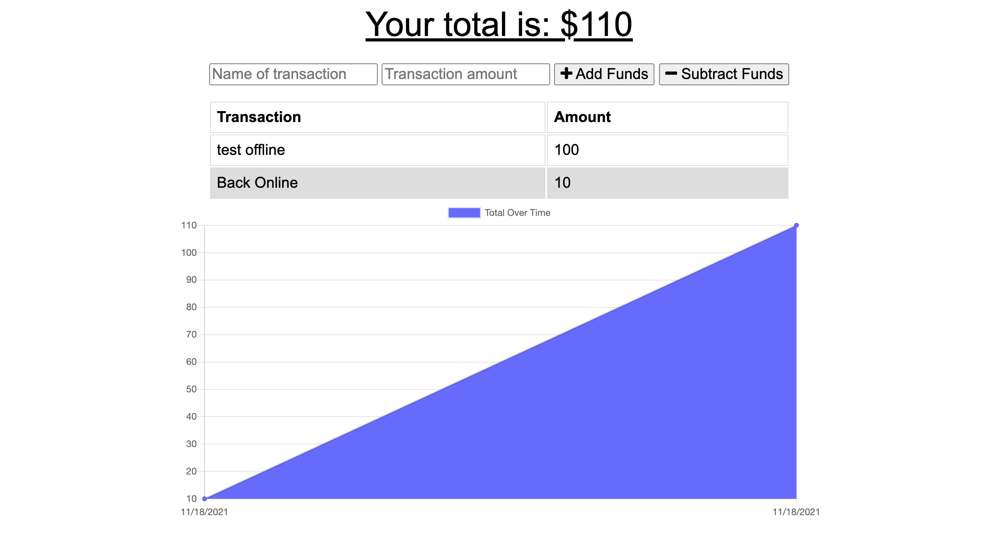

# Online/OffLine Budget Tracker

The goal of this app is to provide the user with a way to track their deposits and expenses while connected or disconnected to the internet.

Offline Functionality:

  * Enter deposits offline

  * Enter expenses offline

When brought back online:

  * Offline entries are added to tracker.

## User Story
AS AN avid traveller
I WANT to be able to track my withdrawals and deposits with or without a data/internet connection
SO THAT my account balance is accurate when I am traveling

## Business Context

Giving users a fast and easy way to track their money is important, but allowing them to access that information anytime is even more important. Having offline functionality is paramount to our applications success.

## Getting Started

The user will need to clone the repository from GitHub and run the command `npm install` on their command line, after install user will need to run `npm start` turn the server on for communication.

## Deployed Link

* [See Live Site](https://safe-stream-85728.herokuapp.com/)
* [See GitHub Repo](https://github.com/maweiche/budgetTracker)

## Authors

* **Matt Weichel** 

- [Link to Github](https://github.com/maweiche)

## License

This project is licensed under the MIT License 

## Acknowledgments

* Hat tip to anyone whose code, libraries, packages, or UI was used  / inspired from
